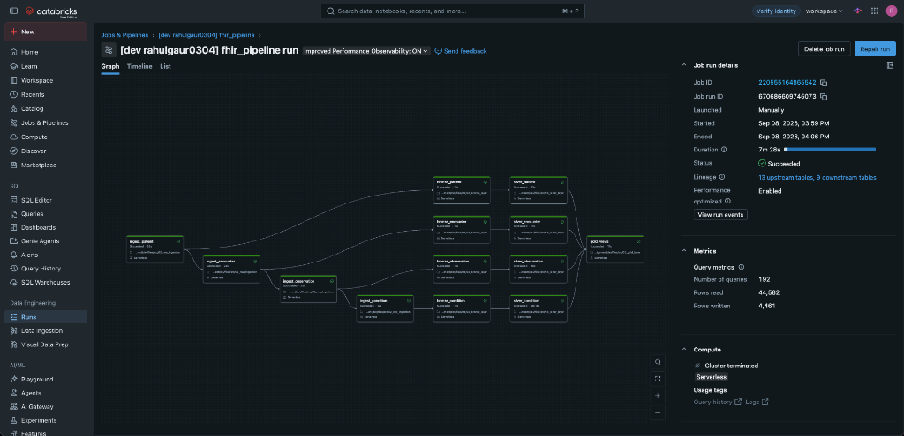
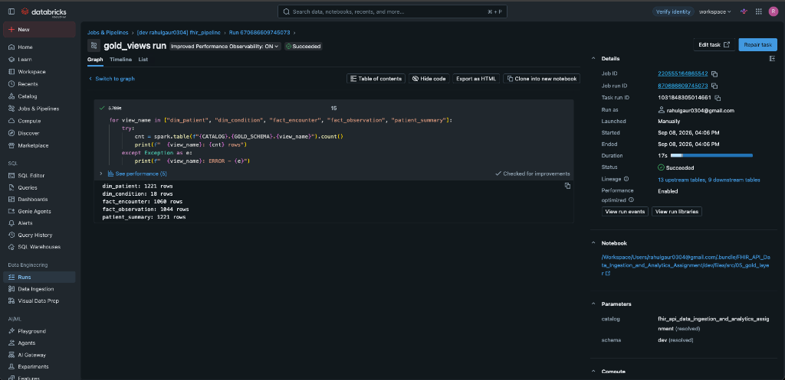

# FHIR API Data Ingestion & Analytics

Medallion Lakehouse Architecture on Databricks for incrementally ingesting and analyzing FHIR R4 healthcare data.

## Data Source

**HAPI FHIR R4 Public API**: https://hapi.fhir.org/baseR4/

Resources ingested:
- **Patient** — Demographics, identifiers, addresses
- **Encounter** — Visits, admissions, class/type/status
- **Observation** — Lab results, vitals (LOINC coded)
- **Condition** — Diagnoses, clinical/verification status (ICD-10)

## Architecture

```
HAPI FHIR R4 API
       |
       | HTTP GET + pagination (_lastUpdated, _count, next link)
       v
+---------------------------+
|     RAW LAYER (Volumes)   |   JSON files bucketed by date
|  /raw_files/Patient/      |   e.g. /Patient/2024-09-03/page_0001.json
|  /raw_files/Encounter/    |
|  /raw_files/Observation/  |
|  /raw_files/Condition/    |
+---------------------------+
       |
       | Parse JSON, explode Bundle entries, flatten fields
       v
+---------------------------+
|   BRONZE LAYER (Delta)    |   bronze_patient, bronze_encounter, ...
|   + extraction_timestamp  |   + ingestion_log table (API call tracking)
|   + api_url_or_params     |
+---------------------------+
       |
       | Clean, deduplicate, SCD Type 2 merge
       v
+---------------------------+
|   SILVER LAYER (Delta)    |   silver_patient, silver_encounter, ...
|   + is_current            |   Historical versioning via SCD2
|   + valid_from / valid_to |   (record_hash for change detection)
+---------------------------+
       |
       | Joins, aggregations, analytical views
       v
+---------------------------+
|   GOLD LAYER (Views)      |   dim_patient, dim_condition
|                           |   fact_encounter, fact_observation
|                           |   patient_summary
+---------------------------+
```

## Project Structure

```
├── config/
│   └── resource_registry.yml    # Central config: API endpoints, tables, SCD2 columns
├── src/
│   ├── 01_config.py             # Shared config notebook (loaded by all others)
│   ├── 02_raw_ingestion.py      # Raw layer: API fetch + JSON storage
│   ├── 03_bronze_layer.py       # Bronze layer: JSON → Delta tables
│   ├── 04_silver_layer.py       # Silver layer: clean, dedup, SCD Type 2
│   └── 05_gold_layer.py         # Gold layer: analytical views
├── resources/
│   └── fhir_pipeline.job.yml    # Databricks Workflow definition
├── docs/
│   ├── assignment/              # Assignment specification PDF
│   └── images/                  # Pipeline DAG run and verification screenshots
├── databricks.yml               # Databricks Asset Bundle config
└── pyproject.toml               # Python project dependencies
```

## Table Relationships

```
dim_patient (from silver_patient, is_current=true)
    |
    |-- fact_encounter (silver_encounter joined on patient_reference)
    |       |
    |       |-- fact_observation (silver_observation joined on patient + encounter ref)
    |
    |-- patient_summary (aggregated encounters, conditions, observations per patient)

dim_condition (distinct condition codes from silver_condition)
```

### Tables Created

| Layer | Table | Description |
|-------|-------|-------------|
| Bronze | `bronze_patient` | Raw patient data with metadata |
| Bronze | `bronze_encounter` | Raw encounter data with metadata |
| Bronze | `bronze_observation` | Raw observation data with metadata |
| Bronze | `bronze_condition` | Raw condition data with metadata |
| Bronze | `ingestion_log` | Tracks every API call (URL, timestamp, status, record count) |
| Silver | `silver_patient` | Cleaned + SCD2 versioned patients |
| Silver | `silver_encounter` | Cleaned + SCD2 versioned encounters |
| Silver | `silver_observation` | Cleaned + SCD2 versioned observations |
| Silver | `silver_condition` | Cleaned + SCD2 versioned conditions |
| Gold | `dim_patient` | Patient dimension (current records) |
| Gold | `dim_condition` | Condition code dimension |
| Gold | `fact_encounter` | Encounter facts with patient info + duration |
| Gold | `fact_observation` | Observation facts with patient info |
| Gold | `patient_summary` | Per-patient KPIs (encounter count, conditions, observations) |

## Pipeline Orchestration

The Databricks Workflow runs daily and executes tasks in this order:

1. **Ingestion** (sequential): Patient → Encounter → Observation → Condition
2. **Bronze + Silver** (parallel per resource): Each resource starts its bronze→silver chain as soon as its ingestion completes
3. **Gold** (after all silver tasks): Creates/refreshes analytical views

## Pipeline Execution & Validation

The pipeline was executed end-to-end on Databricks Serverless compute using Databricks Asset Bundles (DABs). All 13 tasks succeeded.

- **Job ID**: `220555164865542`
- **Run ID**: `670686609745073`
- **Status**: `Succeeded`
- **Duration**: 7m 28s
- **Queries Executed**: 192
- **Rows Processed**: 44,582 read | 4,461 written

### Workflow DAG Execution



### Gold Layer Row Counts & Verification

All 5 analytical views were verified and returned accurate row counts:

| Object | Type | Row Count | Description |
|---|---|:---:|---|
| **`dim_patient`** | Dimension View | **1,221** | Current deduplicated patient demographics |
| **`dim_condition`** | Dimension View | **18** | Distinct active condition codes |
| **`fact_encounter`** | Fact View | **1,060** | Encounters linked to patients with duration |
| **`fact_observation`** | Fact View | **1,044** | Clinical observations and measurements |
| **`patient_summary`** | KPI Summary View | **1,221** | Aggregated patient metrics and condition lists |



## Data Versioning (SCD Type 2)

The Silver layer implements Slowly Changing Dimension Type 2:

- **`record_hash`** — MD5 hash of all business columns (defined in `config/resource_registry.yml`)
- On each run, incoming records are compared against current Silver records
- If the hash changed → old record is expired (`is_current=false`, `valid_to=now`), new version inserted
- If no change → no update
- Full history is preserved for auditing

## Metadata Tracking

Every API call is logged to `ingestion_log` with:
- `extraction_timestamp` — when the API was called
- `save_timestamp` — when data was saved to storage
- `api_url` — the exact URL called (including filters)
- `records_fetched`, `status`, `error_message`

Bronze tables include `extraction_timestamp` and `api_url_or_params` on every row.

## How to Run

```bash
# Validate the bundle
databricks bundle validate

# Deploy to Databricks workspace
databricks bundle deploy

# Run the pipeline
databricks bundle run fhir_pipeline
```

## Configuration

All resource definitions are in `config/resource_registry.yml`. To add a new FHIR resource:

1. Add an entry under `resources:` with `api_path`, `bronze_table`, `silver_table`, and `scd2_hash_columns`
2. Add a flatten function in `03_bronze_layer.py`
3. Add tasks in `resources/fhir_pipeline.job.yml`

## Dependencies

- `requests` — HTTP calls to FHIR API
- `pyyaml` — Config file parsing
- PySpark, Delta Lake — pre-installed on Databricks Runtime
